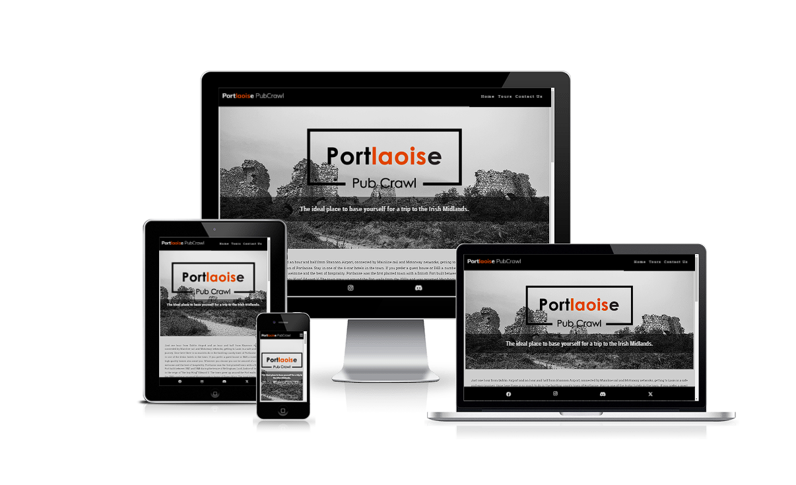

<h1 align="center"></h1>

<h1 align="center">Portlaoise PubCrawl</h1>

<h2>Mission:</h2>

Welcome to our PubCrawl Website! Our mission is to deliver essential information and entertainment, offering a unique day historic tour through the city and an exciting night pub tour. Ensuring a safe and enjoyable experience for all participants.

<a href="https://patilacerda.github.io/Portlaoise-Pubcrawl_PP1/index.html">View the deployed project here.</a>

<h2 align="center"></h2>

<h2>Vision:</h2>

Our vision is to create a different and memorable experience, providing a fresh perspective on the city's history and pub scene.We aim to bring out the best of the city and its pubs, ensuring a safe and enjoyable adventure.

<h2>Scope:</h2>

This website strikes a perfect equilibrium between captivating pictures of the city and providing relevant information about our tours. We offer an easy booking system, essential address and map details and customer reviews.

<h2>Features:</h2>

<h3>Homepage:</h3>

<ul>
<li>A visually appealing banner showcasing iconic city landmarks and lively pubs.</li>
<li>A brief introduction to our day historic tour and night pub tour.</li>
<li>"Book Now" buttons for both tours for quick reservations.</li>
<li>Latest reviews.</li>
</ul>

<h2>Tours</h2>

<h3>Day Historic Tour:</h3>

<ul>
<li>An exciting description of the day historic tour, highlighting key landmarks and historical spots.</li>
<li>A captivating image showcasing the city's rich history and culture.</li>
<li>"Book Now" button for convenient reservations.</li>
</ul>

<h3>Night Pub Tour:</h3>

<ul>
<li>An enticing description of the night pub tour, featuring popular pubs and entertainment spots.</li>
<li>Image of vibrant nightlife scene and enthusiastic participants.</li>
<li>"Book Now" button for easy reservations.</li>
</ul>

<h3>Reviews:</h3>

<ul>
<li>Customer testimonials and reviews from past participants, sharing their memorable experiences.</li>
<li>Star ratings for each tour and overall satisfaction.</li>
</ul>

<h3>Address and Map:</h3>

<ul>
<li>Clear address details and contact information for easy communication.</li>
<li>An interactive map with marked location for our meeting point.</li>
</ul>

<h3>Future Features</h3>

<ul>
<li>A user-friendly calendar displaying upcoming tour dates and availability.</li>
</ul>

<h2>User Experience (UX)</h2>

<h3>User stories</h3>

<ul>
<li>First Time Visitor Goals</li>
<ul>
<li>As a first time visitor my goal is to have a tourist experience.</li>
<li>As a first time visitor I want to learn about the history of the city.</li>
<li>As a first time visitor I want to find both options for family or adults only experiences.</li>
</ul>
</ul>

<ul>
<li>Returning Visitor Goals</li>
<ul>
<li>As a returning visitor I want a private experience.</li>
<li>As a returning visitor I want to have access to the latest events pictures.</li>
<li>As a returning visitor I want to be informed about the upcoming events.</li>
</ul>
</ul>

<h3>Wireframes</h3>

<h3>Design</h3>

<ul>
<li>Typography</li>
<ul>
<li>Roboto Slab, Serif - The main font.</li>
<li>Roboto Condensed, sans-serif - All headings.</li>
</ul>
<li>Colour Scheme</li>
<ul>
<li>The neutral gray and black were chosen to create a stable and sophisticated foundation for the website, allowing historical content to take center stage making all the pages look like a film frame. The addition of the vibrant orange injects energy capturing the essence of illuminated night streets , draws attention to key elements, and adds a touch of creativity to the overall design.</li>
</ul>
</ul>

<h2>Technologies Used</h2>

<h3>Languages</h3>
<ul>
<li><a href="https://en.wikipedia.org/wiki/HTML5">HTML5</a></li>
<li><a href="https://en.wikipedia.org/wiki/CSS">CSS3</a></li>
</ul>

<h3>Frameworks, Libraries and Programms Used</h3>
<ul>
<li><a href="https://fonts.google.com/">Google Fonts</a> - Provide all of the fonts for this website.</li>
<li><a href="https://fontawesome.com/">Font Awesome</a> - Used for the site icos.</li>
<li><a href="https://www.adobe.com/ie/products/photoshop.html">Photoshop</a> - Used to compress images to reduce file size without a reduction in quality.</li>
<li><a href="https://www.adobe.com/ie/products/illustrator.html">Illustrator</a> - Used to create the logo.</li>
<li><a href="https://git-scm.com/">Git</a> - Git was used for version control by utilizing the Gitpod terminal to commit to Git and Push to GitHub.</li>
<li><a href="https://github.com/patilacerda">Github</a> - Used to hosting the code.</li>
<li><a href="https://balsamiq.com/">Balsamiq</a> - Used to create site wireframes.</li>
<li><a href="https://google-map-generator.com/">Google map generator</a> - Used to import business location.</li>
<li><a href="http://ami.responsivedesign.is/">Am I Responsive</a> - Used to check if the site is responsive on different screen sizes.</li>
<li><a href="http://www.responsinator.com/">Responsinator</a> - Used to check if the site is responsive on different screen sizes.</li>
<li><a href="https://developer.chrome.com/docs/devtools/">Chrome Dev Tools</a>- Used for overall development and tweaking, including testing responsiveness and performance.</li>
</ul>

<h2>Testing</h2>

<h3>Validating</h3>

<ul>
<li>HTML - No errors were returned when passing through the official <a href="https://validator.w3.org/nu/">W3C Markup Validator</a>.</li>
<li>CSS - No errors were found when passing through the official <a href="https://jigsaw.w3.org/css-validator/">W3C CSS Validator</a>.</li>
<li>Accessibility - </li>
</ul>

<h3>Further Testing</h3>

<ul>
<li>Tested on Chrome, Opera, Microsoft Edge and Firefox desktop version browsers.</li>
<li>Chrome Developer Tools are used to test the responsiveness on: Desktop, Laptop, iPhone SE, iPhone XR, iPhone 12 Pro, iPad, iPad Pro, Galaxy Fold.</li>
</ul>

<h3>Known Bugs</h3>

<ul>
<li>On some mobile devices the Hero Image pushes the size of screen out more than any of the other content on the page. A gray gap can be seen to the right of the footer and navigation bar as a result.</li>
</ul>

<h2>Deployment</h2>

The project was deployed using GitHub pages. The steps to deploy using GitHub pages are:

<ol>
<li>Go to the repository on GitHub.com.</li>
<li>Select 'Settings' near the top of the page.</li>
<li>Select 'Pages' from the menu bar on the left of the page.</li>
<li>Under 'Source' select the 'Branch' dropdown menu and select the main branch.</li>
<li>Once selected, click the 'Save'.</li>
<li>Deployment should be confirmed by a message on a green background saying "Your site is published at" followed by the web address.</li>
</ol>

<h2>Credits</h2>

<h3>Content</h3>

All content was sourced from <a href="https://laoistourism.ie/">Laois Tourism</a> website.

Dropdown nav bar and footer inspired from “Love Running” Project.

<h3>Media</h3>

All the images were sourced from <a href="https://www.flickr.com/photos/williampaiva/">William Paiva - Photographer Flickr page</a> and his personal archive.

<h3>Acknowlegdments</h3>

My therapist for emotional support and advice.

My husband for all the Media content.

The Code Institute slack community.
